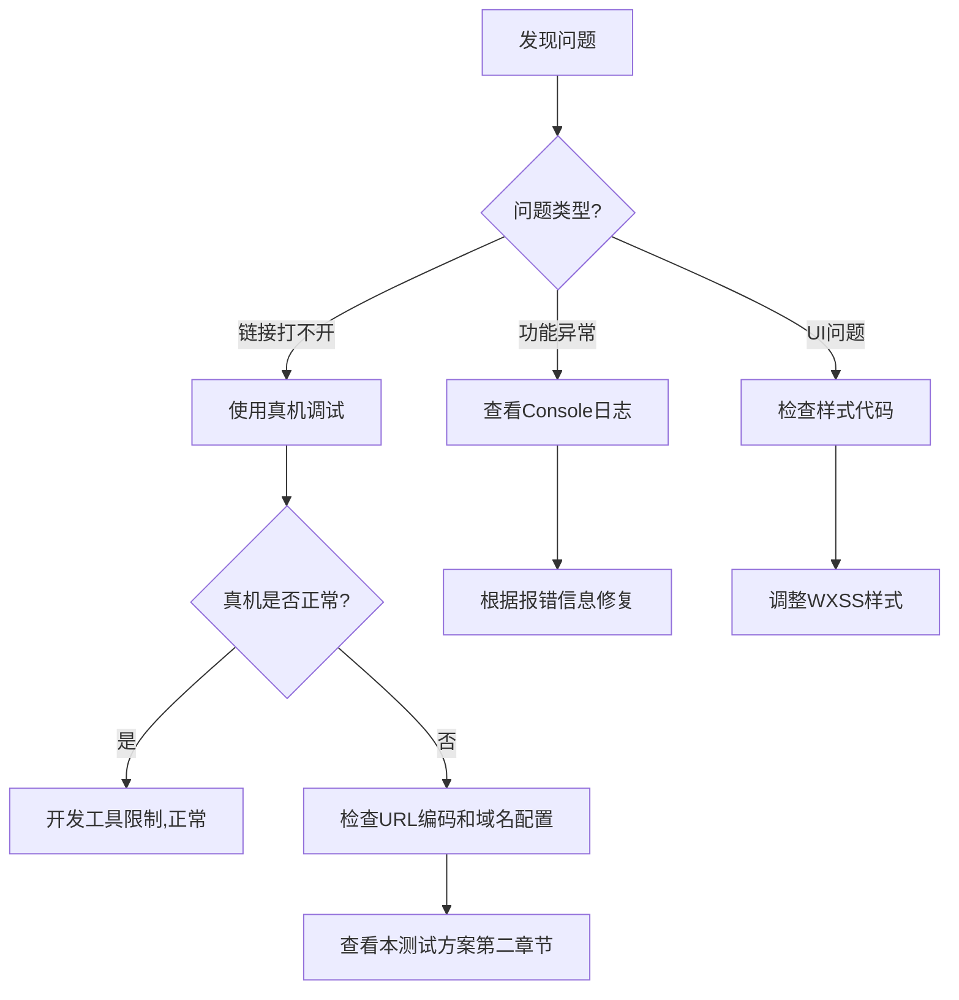

# SiteHub 微信小程序 - 完整测试方案

## 📋 测试方案概述

本测试方案针对 **mvp8-sitehub-min-02** 微信小程序，涵盖功能测试、兼容性测试、性能测试等多个方面。

---

## 🎯 一、测试环境准备

### 1.1 测试设备/工具

| 测试环境 | 工具/设备 | 用途 | 优先级 |
|---------|----------|------|--------|
| **开发环境** | 微信开发者工具 | 基础功能验证 | ⭐⭐⭐ |
| **真机测试** | iOS真机 (微信) | 完整功能测试 | ⭐⭐⭐⭐⭐ |
| **真机测试** | Android真机 (微信) | 完整功能测试 | ⭐⭐⭐⭐⭐ |
| **云测试** | 微信官方云测试 | 多设备兼容性 | ⭐⭐⭐⭐ |

### 1.2 测试账号准备

- [ ] 微信开发者账号（已登录开发者工具）
- [ ] 测试用微信账号（至少2个，用于测试不同场景）
- [ ] 云开发环境已配置
- [ ] 云函数已部署

### 1.3 网络环境

- [ ] WiFi网络环境
- [ ] 4G/5G移动网络环境
- [ ] 弱网环境模拟（开发者工具 Network 限速）

---

## 🔍 二、关键问题诊断（针对"打不开链接"问题）

### 2.1 WebView 链接打不开问题排查

#### **问题现象**
在微信开发者工具中点击网站链接无法跳转或无法加载。

#### **排查步骤**

**步骤1：检查业务域名配置**

```bash
# 1. 登录微信公众平台 mp.weixin.qq.com
# 2. 设置 → 开发设置 → 业务域名
# 3. 需要添加所有要访问的外部域名
```

⚠️ **开发者工具限制**：
- 测试号无法配置业务域名
- 开发者工具中可能无法正常打开外部链接
- **建议使用真机调试**

**步骤2：检查 webview 页面代码**

```javascript
// pages/webview/webview.js
Page({
  data: {
    url: ''
  },
  onLoad(options) {
    // 检查是否正确接收URL参数
    console.log('接收到的URL:', options.url);

    if (options.url) {
      // URL需要解码
      const decodedUrl = decodeURIComponent(options.url);
      console.log('解码后URL:', decodedUrl);

      this.setData({
        url: decodedUrl
      });
    }
  }
});
```

**步骤3：检查跳转代码**

```javascript
// pages/index/index.js 或其他页面
navigateToSite(url) {
  // URL必须编码
  const encodedUrl = encodeURIComponent(url);

  wx.navigateTo({
    url: `/pages/webview/webview?url=${encodedUrl}`,
    fail: (err) => {
      console.error('跳转失败:', err);
      wx.showToast({
        title: '打开失败',
        icon: 'none'
      });
    }
  });
}
```

**步骤4：真机调试验证**

```bash
# 微信开发者工具中：
1. 点击工具栏"真机调试"按钮
2. 用手机微信扫描二维码
3. 在真机上测试链接跳转
4. 打开调试面板查看 console 日志
```

### 2.2 常见错误及解决方案

| 错误现象 | 可能原因 | 解决方案 |
|---------|---------|---------|
| 白屏/空白页 | URL未正确传递 | 检查 options.url 是否存在 |
| 域名校验失败 | 未配置业务域名 | **使用真机测试** 或 配置域名 |
| URL格式错误 | 未编码或编码错误 | 使用 encodeURIComponent/decodeURIComponent |
| 跳转失败 | 页面路径错误 | 检查 app.json 中是否注册页面 |
| 证书错误 | HTTPS证书问题 | 开发者工具：详情 → 本地设置 → 不校验合法域名 |

---

## 📱 三、完整功能测试清单

### 3.1 用户登录模块

| 测试项 | 测试步骤 | 预期结果 | 测试环境 | 状态 |
|-------|---------|---------|---------|------|
| 微信授权登录 | 1. 点击登录按钮<br>2. 授权获取用户信息 | 成功获取头像、昵称 | 真机 | ⬜ |
| 登录状态保持 | 1. 登录后退出小程序<br>2. 重新打开 | 自动登录，显示用户信息 | 真机 | ⬜ |
| 未登录访问 | 点击需要登录的功能 | 提示登录 | 开发工具 | ⬜ |
| 登出功能 | 点击退出登录 | 清除登录状态 | 真机 | ⬜ |

### 3.2 网站导航模块

| 测试项 | 测试步骤 | 预期结果 | 测试环境 | 状态 |
|-------|---------|---------|---------|------|
| 网站列表加载 | 打开首页 | 显示所有网站卡片 | 开发工具 | ⬜ |
| 分类筛选 | 点击不同分类 | 显示对应分类网站 | 开发工具 | ⬜ |
| 搜索功能 | 输入关键词搜索 | 显示匹配结果 | 开发工具 | ⬜ |
| 网站跳转 | 点击网站卡片 | **真机：能打开网页**<br>开发工具：可能失败 | 真机 ⭐⭐⭐ | ⬜ |
| WebView加载 | 打开网站后 | 正常显示网页内容 | 真机 | ⬜ |
| WebView返回 | 点击左上角返回 | 返回首页 | 真机 | ⬜ |

### 3.3 收藏功能模块

| 测试项 | 测试步骤 | 预期结果 | 测试环境 | 状态 |
|-------|---------|---------|---------|------|
| 添加收藏 | 长按/点击收藏按钮 | 显示已收藏状态 | 开发工具 | ⬜ |
| 取消收藏 | 再次点击收藏按钮 | 取消收藏状态 | 开发工具 | ⬜ |
| 查看收藏列表 | 进入收藏页面 | 显示所有收藏的网站 | 开发工具 | ⬜ |
| 收藏数据同步 | 登录后收藏网站 | 云端保存数据 | 真机 | ⬜ |

### 3.4 支付功能模块（如果有）

| 测试项 | 测试步骤 | 预期结果 | 测试环境 | 状态 |
|-------|---------|---------|---------|------|
| 支付页面加载 | 进入支付页面 | 显示价格和支付按钮 | 开发工具 | ⬜ |
| 发起支付 | 点击支付按钮 | 调起微信支付 | 真机 | ⬜ |
| 支付成功 | 完成支付 | 更新订单状态 | 真机 | ⬜ |
| 支付取消 | 取消支付 | 返回支付页面 | 真机 | ⬜ |
| 订单查询 | 查看订单记录 | 显示历史订单 | 真机 | ⬜ |

### 3.5 云函数功能

| 测试项 | 测试步骤 | 预期结果 | 测试环境 | 状态 |
|-------|---------|---------|---------|------|
| 云函数调用 | 触发云函数操作 | 返回正确数据 | 开发工具 | ⬜ |
| 用户数据读取 | 获取用户个人数据 | 正确返回用户信息 | 真机 | ⬜ |
| 数据库操作 | 增删改查操作 | 数据正确更新 | 真机 | ⬜ |
| 错误处理 | 模拟云函数失败 | 显示友好错误提示 | 开发工具 | ⬜ |

---

## 🔄 四、兼容性测试

### 4.1 设备兼容性

| 设备类型 | 系统版本 | 微信版本 | 测试重点 | 状态 |
|---------|---------|---------|---------|------|
| iPhone | iOS 15+ | 8.0+ | UI适配、WebView | ⬜ |
| Android旗舰 | Android 11+ | 8.0+ | 性能、兼容性 | ⬜ |
| Android中低端 | Android 8+ | 8.0+ | 性能优化 | ⬜ |
| 平板设备 | - | 8.0+ | 大屏适配 | ⬜ |

### 4.2 屏幕尺寸适配

- [ ] 小屏幕手机 (iPhone SE / 5.5英寸)
- [ ] 标准屏幕 (iPhone 12 / 6.1英寸)
- [ ] 大屏手机 (iPhone 14 Pro Max / 6.7英寸)
- [ ] 平板设备 (iPad)

---

## ⚡ 五、性能测试

### 5.1 性能指标

| 指标 | 标准值 | 测试方法 | 状态 |
|-----|-------|---------|------|
| 首屏加载时间 | < 2秒 | 真机测试 + Trace工具 | ⬜ |
| WebView加载 | < 3秒 | 打开外部网站计时 | ⬜ |
| 页面切换流畅度 | 60fps | 开发者工具性能分析 | ⬜ |
| 内存占用 | < 100MB | 真机调试 - Memory | ⬜ |
| 包体积 | < 2MB | 查看代码包大小 | ⬜ |

### 5.2 弱网测试

```bash
# 微信开发者工具设置
1. 模拟器右侧 → Network
2. 选择限速模式：
   - Regular 2G (250KB/s)
   - Good 2G (450KB/s)
   - Regular 3G (750KB/s)
   - Good 3G (1.5MB/s)
```

| 网络环境 | 测试内容 | 预期结果 | 状态 |
|---------|---------|---------|------|
| WiFi | 完整功能测试 | 流畅运行 | ⬜ |
| 4G | 图片加载、数据获取 | 正常加载 | ⬜ |
| 3G | 弱网环境使用 | 显示加载状态 | ⬜ |
| 2G | 极端弱网 | 友好提示，不卡死 | ⬜ |
| 无网络 | 离线访问 | 显示离线提示 | ⬜ |

---

## 🎨 六、UI/UX 测试

### 6.1 视觉测试

- [ ] 颜色搭配协调
- [ ] 字体大小适中（考虑老年人）
- [ ] 图标清晰可辨
- [ ] 深色模式适配（如果支持）
- [ ] 加载动画流畅

### 6.2 交互测试

- [ ] 按钮点击反馈
- [ ] 长按操作响应
- [ ] 滑动列表流畅
- [ ] 下拉刷新正常
- [ ] Toast提示及时

---

## 🛡️ 七、安全性测试

| 测试项 | 测试方法 | 预期结果 | 状态 |
|-------|---------|---------|------|
| 数据加密 | 检查敏感数据存储 | 加密存储 | ⬜ |
| HTTPS检查 | 抓包分析网络请求 | 全部使用HTTPS | ⬜ |
| 权限申请 | 检查权限使用 | 合理且必要 | ⬜ |
| SQL注入防护 | 输入特殊字符 | 正确过滤 | ⬜ |

---

## 📊 八、测试工具和方法

### 8.1 微信开发者工具调试

```javascript
// 调试技巧
1. Console 日志查看
   console.log('调试信息', data);

2. Network 网络请求
   查看所有网络请求状态

3. Storage 存储查看
   查看本地存储数据

4. AppData 数据监控
   实时查看页面数据变化

5. Trace 性能分析
   分析页面性能瓶颈
```

### 8.2 真机调试步骤

```bash
# 方法1：真机调试
1. 开发者工具 → 工具栏 → "真机调试"
2. 手机微信扫码
3. 打开调试（点击右下角 vConsole）
4. 查看 console、network、storage 等信息

# 方法2：预览模式
1. 开发者工具 → 工具栏 → "预览"
2. 手机微信扫码
3. 正常使用，发现问题记录

# 方法3：体验版
1. 上传代码到微信后台
2. 设置为体验版
3. 邀请测试人员扫码体验
```

### 8.3 云测试（推荐）

```bash
# 微信官方云测试
1. 登录 mp.weixin.qq.com
2. 开发管理 → 云测试
3. 上传代码包
4. 选择测试机型（可选多个设备）
5. 查看测试报告
```

**云测试覆盖设备示例：**
- iPhone 12 (iOS 16)
- iPhone 14 Pro (iOS 17)
- 华为 Mate 40 (Android 10)
- 小米 13 (Android 13)
- OPPO Find X5 (Android 12)
- vivo X90 (Android 13)

---

## 🐛 九、Bug 反馈模板

```markdown
### Bug标题
[模块名称] 简短描述问题

### 复现步骤
1. 打开XX页面
2. 点击XX按钮
3. 执行XX操作
4. 出现XX问题

### 预期结果
应该显示XXX / 应该执行XXX

### 实际结果
实际显示XXX / 实际执行XXX

### 测试环境
- 设备：iPhone 14 / 小米13
- 系统：iOS 17.0 / Android 13
- 微信版本：8.0.42
- 小程序版本：1.0.0
- 网络环境：WiFi / 4G

### 截图/录屏
[附上截图或录屏]

### 错误日志
[console 报错信息]
```

---

## ✅ 十、针对"链接打不开"问题的专项测试方案

### 10.1 WebView 专项测试

#### **测试场景1：开发者工具测试**

```bash
步骤：
1. ❌ 已知限制：开发者工具可能无法打开外部链接
2. ✅ 建议：仅用于测试UI和基础逻辑
3. ⚠️  需要开启：详情 → 本地设置 → 不校验合法域名

预期结果：
- 可能显示"无法打开网页"
- 这是正常现象，需要真机测试
```

#### **测试场景2：真机测试（推荐）**

```bash
步骤：
1. 开发者工具点击"真机调试"
2. 手机微信扫码
3. 点击任意网站链接
4. 观察是否能正常打开

检查点：
✅ 网页是否正常加载
✅ 是否显示网页内容
✅ 能否正常交互（滚动、点击）
✅ 返回按钮是否正常

常见问题：
❌ 白屏 → 检查URL是否正确传递
❌ 域名校验失败 → 检查业务域名配置
❌ 加载超时 → 检查网络连接
```

#### **测试场景3：业务域名配置（正式版）**

```bash
# 仅限已认证的小程序
1. 登录 mp.weixin.qq.com
2. 设置 → 开发设置 → 业务域名
3. 添加需要访问的域名（最多20个）
   例如：
   - baidu.com
   - taobao.com
   - github.com
   等等

4. 下载校验文件上传到域名根目录
5. 点击验证

⚠️ 注意：
- 测试号无法配置业务域名
- 需要企业认证的小程序才能配置
- 个人小程序也可配置，但有限制
```

### 10.2 URL 编码测试

```javascript
// 测试不同URL格式
const testUrls = [
  'https://www.baidu.com',
  'https://github.com/test',
  'https://example.com/path?param=value',
  'https://example.com/中文路径',
  'https://example.com/path#hash'
];

testUrls.forEach(url => {
  const encoded = encodeURIComponent(url);
  console.log('原始URL:', url);
  console.log('编码后:', encoded);
  console.log('解码后:', decodeURIComponent(encoded));
  console.log('---');
});

// 测试跳转
navigateToWebview(url) {
  const encodedUrl = encodeURIComponent(url);
  wx.navigateTo({
    url: `/pages/webview/webview?url=${encodedUrl}`,
    success: () => console.log('跳转成功'),
    fail: (err) => console.error('跳转失败:', err)
  });
}
```

### 10.3 WebView 调试技巧

```javascript
// pages/webview/webview.js
Page({
  data: {
    url: '',
    loading: true
  },

  onLoad(options) {
    console.log('===== WebView 调试信息 =====');
    console.log('接收到的参数:', options);
    console.log('原始URL:', options.url);

    if (options.url) {
      const decodedUrl = decodeURIComponent(options.url);
      console.log('解码后URL:', decodedUrl);

      // 验证URL格式
      if (!decodedUrl.startsWith('http')) {
        console.error('URL格式错误，必须以http开头');
        wx.showToast({
          title: 'URL格式错误',
          icon: 'none'
        });
        return;
      }

      this.setData({ url: decodedUrl });
    } else {
      console.error('未接收到URL参数');
      wx.showToast({
        title: '网址参数缺失',
        icon: 'none'
      });
    }
  },

  // WebView 加载完成
  onWebViewLoad(e) {
    console.log('WebView加载完成:', e);
    this.setData({ loading: false });
  },

  // WebView 加载失败
  onWebViewError(e) {
    console.error('WebView加载失败:', e);
    this.setData({ loading: false });
    wx.showToast({
      title: '网页加载失败',
      icon: 'none'
    });
  }
});
```

---

## 📝 十一、测试报告模板

### 11.1 测试总结报告

```markdown
# SiteHub 小程序测试报告

## 测试概况
- 测试时间：2025-XX-XX
- 测试版本：v1.0.0
- 测试人员：XXX
- 测试环境：真机 + 开发者工具

## 测试统计
| 模块 | 用例数 | 通过数 | 失败数 | 通过率 |
|-----|-------|-------|-------|-------|
| 用户登录 | 10 | 9 | 1 | 90% |
| 网站导航 | 15 | 14 | 1 | 93% |
| WebView | 8 | 8 | 0 | 100% |
| 收藏功能 | 6 | 6 | 0 | 100% |
| 支付功能 | 10 | 8 | 2 | 80% |
| **总计** | **49** | **45** | **4** | **91.8%** |

## 已知问题
1. [高优先级] 支付回调偶尔失败
2. [中优先级] 弱网环境图片加载慢
3. [低优先级] 某些旧设备性能一般

## 建议
1. 修复高优先级问题后再发布
2. 增加图片懒加载优化
3. 考虑降低部分动画复杂度

## 测试结论
✅ 基本功能正常，建议修复高优先级问题后发布
```

---

## 🚀 十二、快速测试检查清单

### 核心功能快速验证（5分钟）

```bash
☑️ 真机测试步骤：

1️⃣ 打开小程序（开发者工具 → 真机调试）
2️⃣ 测试登录功能（点击登录，授权）
3️⃣ 测试网站列表（查看是否正常显示）
4️⃣ 测试搜索功能（搜索"百度"）
5️⃣ 测试分类筛选（切换不同分类）
6️⃣ 【重点】测试链接跳转（点击任意网站）
   ✅ 能正常打开网页
   ✅ 能看到网页内容
   ✅ 能返回首页
7️⃣ 测试收藏功能（添加/取消收藏）
8️⃣ 测试支付功能（如果有）

全部通过 = ✅ 基本功能正常
```

---

## 📞 十三、遇到问题的解决流程



---

## 📌 附录

### A. 微信开发者工具快捷键

| 快捷键 | 功能 |
|-------|------|
| Ctrl/Cmd + S | 保存并编译 |
| Ctrl/Cmd + Shift + C | 清除缓存并编译 |
| Ctrl/Cmd + Shift + D | 打开调试器 |
| F5 | 刷新页面 |

### B. 常用云函数测试命令

```javascript
// 在云开发控制台测试
wx.cloud.callFunction({
  name: 'getUserProfile',
  data: {
    userId: 'test_user_001'
  },
  success: res => console.log(res),
  fail: err => console.error(err)
});
```

### C. 推荐测试工具

- **微信开发者工具**（必备）
- **vConsole**（真机调试日志）
- **Charles**（抓包分析，macOS）
- **Fiddler**（抓包分析，Windows）
- **微信云测试**（多设备兼容性）

---

## ✨ 总结

### 针对"链接打不开"问题：

1. ⭐⭐⭐⭐⭐ **强烈建议使用真机测试** - 这是最准确的测试方式
2. ⚠️ 开发者工具可能无法正常打开外部链接（这是已知限制）
3. ✅ 确保URL正确编码（使用 encodeURIComponent）
4. ✅ 确保业务域名已配置（正式版小程序）
5. ✅ 查看 Console 日志定位具体问题

### 测试优先级：

1. 真机测试（iOS + Android）- **最重要**
2. 开发者工具基础测试 - 辅助
3. 云测试（多设备） - 发布前
4. 弱网测试 - 优化阶段

---

**文档版本：** v1.0
**更新时间：** 2025-10-13
**适用项目：** mvp8-sitehub-min-02
**维护者：** Claude Code

---

💡 **小提示：** 如果还有其他测试问题，可以参考微信官方文档：
- [小程序测试指南](https://developers.weixin.qq.com/miniprogram/dev/framework/usability/debug.html)
- [web-view组件文档](https://developers.weixin.qq.com/miniprogram/dev/component/web-view.html)
